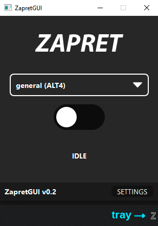
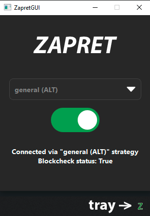

# Zapret GUI

Zapret GUI - графическая оболочка над [zapret](https://github.com/bol-van/zapret).




> [!IMPORTANT]
> Доступно только для windows

## Сборка

```bash
python -m venv .venv
.\.venv\Scripts\activate
pip install -r requirements.txt
python ./setup.py rcc uic
python ./setup.py nuitka
```

Артефакт сборки: `nuitka_build/zapret_gui.exe`